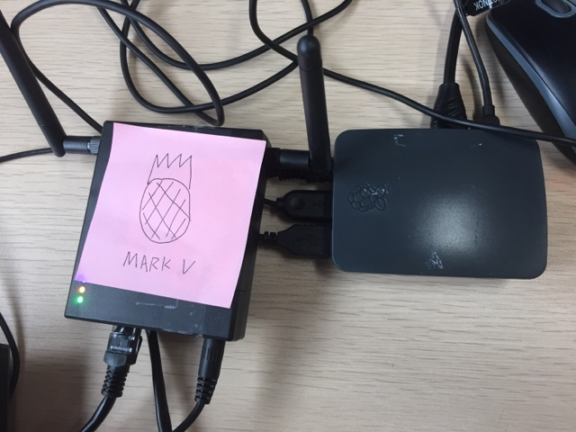

# How to set up WiFi Pineapple on Raspberry Pi to MITM HTTP connections

## References

The setup procedures described in this document are based on the following
references:

* [WiFi Pineapple Mark V with Burp
  Proxy](http://hackedexistence.com/project/wifi-pineapple/wifi-pineapple-mk5-with-burp-proxy.html)
* [Run mitmproxy on Raspberry
  Pi](https://hackaday.io/project/10338/instructions)
* [Blog post: Raspberry
  Pineapple](http://snthenote.blogspot.com/2017/06/blog-post_19.html)

## Tools and Equipment

* Wi-Fi Pineapple Mark V (WP-5)
* Raspberry Pi 3 (RPI-3) running Raspbian Linux distro
* [mitmproxy](https://mitmproxy.org/), version 0.18.2, with python 2.7 on
  Raspbian.

## Connect WP-5 with RPI-3

Generally speaking, follow the instructions in this video: [Linux Internet
Connection Sharing - WiFi Pineapple Mark V - Pineapple
University](https://www.youtube.com/watch?v=f94FZSJs4ms).  On the RPI-3, `wlan0`
is the interface to the Internet, `eth0` is the interface (wired) to the WP-5;
the internet connection will be shared by the RPI-3 from `wlan0` to `eth0` to
serve the WP-5.



Download the script that configures iptables rules and executes it (no MITM
proxy yet).

```bash
wget https://www.wifipineapple.com/wp5.sh
chmod u+x wp5.sh
sudo ./wp5.sh
```

It is usually safe to keep all default settings, except for the "Internet
Gateway" IP address, which shall be set as `wlan0`'s corresponding gateway
address (e.g., 192.168.0.1. Run `ifconfig` beforehand to find out the info). Now
visit <http://172.16.42.1:1471> to configure the WP-5. Once the WP-5 is
configured, for example, turn on "PineAP" for some fun.

### How to play

For example, to intercept all HTTP traffic through the WP-5, do

```bash
sudo tcpdump -A -s 0 -i eth0 -w http_dump.pcap tcp port http
```

Here,

* `-A` means ouput in ASCII
* `-s 0` means output all payload content
* `-i eth0` means capture packets on eth0 interface
* `-w http_dump.pcap` sets the output dump file
* `tcp port http` means capture only HTTP packets

Once enough data has been collected, use Wireshark or
[foremost](https://linux.die.net/man/1/foremost) to analyze the pcap dump:
`http_dump.pcap`.

## Man-in-the-middle HTTP/HTTPS traffic

1. Install `mitmproxy` on RPI-3 (use python 2 for example)

   ```bash
   sudo aptitude install python-setuptools python-dev build-essential
   sudo easy_install pip
   sudo pip install mitmproxy==0.18.2
   ```

2. Run the modified WP-5 configuration script
   [wp5_mitmproxy.sh](src/wp5_mitmproxy.sh) to add port forwarding rules (from
   80 and 443 to 8080, the port `mitmproxy` listens on by default).

   ```bash
   cd src/
   sudo ./wp5_mitmproxy.sh
   ```

   Do a `diff wp5.sh wp5_mitmproxy.sh` to see the added rules for NAT port
   forwarding.

3. Run `mitmproxy` and `mitmdump`.

   ```bash
   mitmproxy -T --host
   ```

   You can watch the HTTP traffic from the console.

   ```bash
   mitmdump -T -s hacked.py
   ```

   This will intercept the HTTP response, and add "HACKED!!!" text at the bottom
   of the page.

## Related tutorial

* [How to set up mitmproxy for pentest in
  Docker](https://github.com/syncom/mitmproxy-hermit): An example of setting up
  `mitmproxy` for testing an application from inside a Docker image
